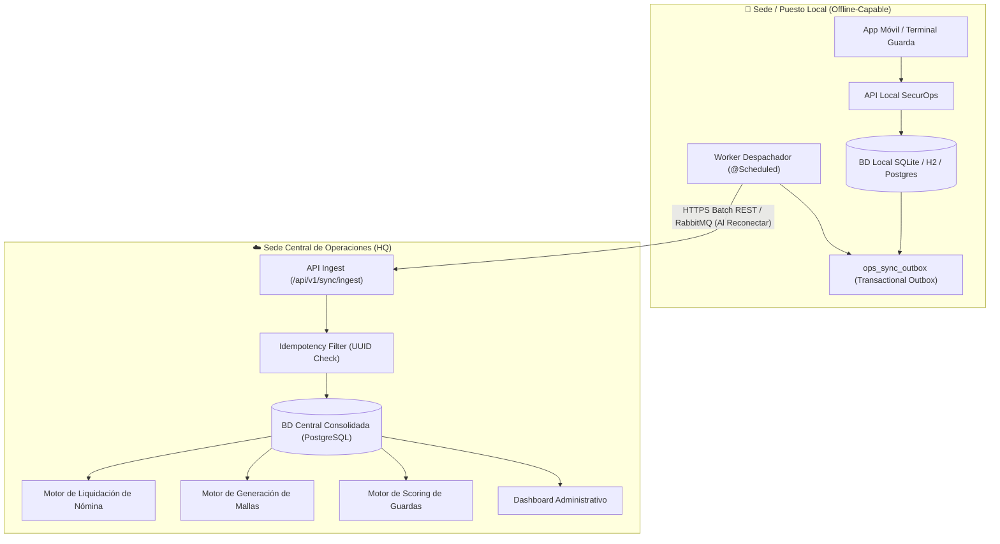

<div align="center">

# 🛡️ SecurOps (Security Operations)
### Enterprise Workforce Management, Shift Scheduling, Resilient Sync & Payroll Engine

[](https://openjdk.org/)
[](https://spring.io/projects/spring-boot)
[](https://spring.io/projects/spring-security)
[](#arquitectura-del-sistema)
[](LICENSE)

*Plataforma empresarial de grado de producción para la gestión operativa, generación matemática de mallas de turnos, tolerancia a desconexión multisitio y liquidación legal de nómina para compañías de vigilancia y seguridad privada.*

---

</div>

## 📑 Tabla de Contenidos
- [🎯 Visión y Propósito del Proyecto](#-visión-y-propósito-del-proyecto)
- [✨ Módulos Principales](#-módulos-principales)
- [📐 Arquitectura del Sistema](#-arquitectura-del-sistema)
- [🧮 Motor Matemático de Turnos y Rotaciones](#-motor-matemático-de-turnos-y-rotaciones)
- [🔄 Sincronización Resiliente Multisitio (Offline-First)](#-sincronización-resiliente-multisitio-offline-first)
- [💰 Motor de Nómina y Recargos de Ley](#-motor-de-nómina-y-recargos-de-ley)
- [📊 Scoring y Analítica del Guarda](#-scoring-y-analítica-del-guarda)
- [🚀 Puesta en Marcha Rápida](#-puesta-en-marcha-rápida)
- [📡 Catálogo de Endpoints REST](#-catálogo-de-endpoints-rest)
- [📁 Estructura del Código](#-estructura-del-código)
- [📄 Licencia](#-licencia)

---

## 🎯 Visión y Propósito del Proyecto

Las operaciones en empresas de seguridad privada presentan retos logísticos y regulatorios de alta complejidad:
1. **Generación de turnos ininterrumpidos**: Garantizar cobertura 24/7 sin puestos descubiertos ni horas extras no autorizadas.
2. **Conectividad inestable en puestos remotos**: Las garitas y puestos perimetrales suelen experimentar microcortes o caídas prolongadas de red.
3. **Cálculo de nómina hipercomplejo**: Múltiples recargos (nocturnos ordinarios, horas extras diurnas/nocturnas, festivos diurnos/nocturnos) contrastados contra marcaciones biométricas y novedades de personal.
4. **Scoring de desempeño**: Evaluar objetivamente a los guardas mediante asistencia, puntualidad, reporte de llamadas de ronda y procesos disciplinarios.

**SecurOps** proporciona una solución integral, robusta y modular diseñada bajo estándares de ingeniería de software enterprise con **Java 21** y **Spring Boot 3.3**.

---

## ✨ Módulos Principales

| Módulo | Capacidades Clave |
| :--- | :--- |
| **🗓️ Mallas y Turnos** | Generación mensual automatizada de rotaciones (2x2x2, 3x3, 4x4, 6x1, 5x2), balanceo de cuadrillas, control de relevos y alertas inmediatas de puestos descubiertos. |
| **🔄 Sincronización Multisitio** | Patrón *Transactional Outbox* con reintentos programados e ingesta idempotente para tolerancia total a desconexiones entre sedes locales y la central. |
| **⏰ Asistencia y Geocercas** | Marcación de entrada/salida mediante biometría, app móvil con geocercas GPS o llamada a central, midiendo minutos de retraso e incumplimientos. |
| **🚨 Central de Monitoreo** | Control de llamadas periódicas de verificación a puestos físicos, libro de minutas digital y registro de incidentes operativos / armamento. |
| **💵 Nómina y Liquidación** | Liquidación automática según la jornada legal (horas diurnas vs nocturnas 21:00–06:00, recargos al 35%, extras al 1.25x/1.75x, dominicales y descuentos por ausentismo). |
| **📈 Scoring del Guarda** | Algoritmo ponderado (0 a 100 puntos) clasificando el rendimiento en tiers (`EXCELLENT`, `GOOD`, `FAIR`, `AT_RISK`). |
| **🔒 Seguridad y RBAC** | Control de acceso basado en roles (`ADMIN`, `SUPERVISOR`, `OPERATOR`, `GUARD`) con tokens stateless JWT y contraseñas cifradas en BCrypt. |

---

## 📐 Arquitectura del Sistema

El sistema implementa una **Arquitectura Modular Monolítica** orientada al dominio (*Package-by-Feature*), desacoplando las responsabilidades mediante capas de entidades JPA, repositorios Spring Data, servicios transaccionales y controladores REST.



---

## 🧮 Motor Matemático de Turnos y Rotaciones

El subsistema de asignación de turnos implementa el **Patrón Estrategia** (`RotationStrategy`), desacoplando la matemática de rotación de la persistencia de datos.

### Esquema 2x2x2 (12 Horas, Cobertura Continua 24/7)
- **Patrón individual de 6 días**: 2 días Diurnos (06:00–18:00), 2 días Nocturnos (18:00–06:00), 2 días Libres/Descanso.
- **Guardas requeridos por puesto**: $\frac{6 \text{ días} \times 2 \text{ turnos/día}}{4 \text{ turnos trabajados}} = \mathbf{3\text{ guardas}}$.
- **Desfase de fase (Offset)**: Cada guarda entra desfasado exactamente 2 días respecto al anterior:

```
Guarda A (Fase 0):  [ D12 ][ D12 ][ N12 ][ N12 ][ LIB ][ LIB ]
Guarda B (Fase +2): [ LIB ][ LIB ][ D12 ][ D12 ][ N12 ][ N12 ]
Guarda C (Fase +4): [ N12 ][ N12 ][ LIB ][ LIB ][ D12 ][ D12 ]
                     -----------------------------------------
Cobertura Diaria:   1 D12, 1 N12, 1 LIBRE -> 100% Cobertura 24/7 sin huecos
```

### Otros Esquemas Nativos Soportados:
- **3x3 (12h)**: 3 Diurnos, 3 Nocturnos, 3 Libres (Ciclo de 9 días con 3 guardas).
- **4x4 (12h)**: 2 Diurnos, 2 Nocturnos, 4 Libres (Ciclo de 8 días con 4 guardas).
- **6x1 (8h)**: 6 días de trabajo continuo y 1 de descanso en turnos de 8 horas (Mañana, Tarde, Noche).
- **5x2 (8h)**: Jornada administrativa o bancaria de Lunes a Viernes con Sábados y Domingos libres.

---

## 🔄 Sincronización Resiliente Multisitio (Offline-First)

Para mitigar problemas de enlace en puestos remotos:
1. **Consistencia Atómica Local**: Toda marcación o novedad se inserta en su tabla de negocio y en `ops_sync_outbox` dentro de la **misma transacción de base de datos**.
2. **Despacho Asíncrono con Reintentos**: Un worker programado (`@Scheduled`) sondea eventos en estado `PENDING` o `FAILED` y los envía en lotes hacia la central.
3. **Idempotencia en la Central**: Cada evento contiene un `eventId` (UUIDv4). Si un lote se retransmite tras una desconexión, la central valida el identificador en `ops_sync_idempotency` evitando procesar duplicados.

---

## 💰 Motor de Nómina y Recargos de Ley

El servicio `PayrollCalculatorService` analiza los turnos programados vs. asistencias registradas y aplica la legislación laboral:

- **Jornada Ordinaria Diurna**: 06:00 a 21:00 (Factor 1.00x).
- **Recargo Nocturno Ordinario**: 21:00 a 06:00 (+35% sobre valor hora ordinaria).
- **Hora Extra Diurna (HED)**: Primeras horas después de la jornada ordinaria (+25% / Factor 1.25x).
- **Hora Extra Nocturna (HEN)**: Horas extras en franja nocturna (+75% / Factor 1.75x).
- **Recargo Dominical / Festivo Ordinario**: +75% (Factor 1.75x).
- **Recargo Dominical / Festivo Nocturno**: +110% (Factor 2.10x).
- **Horas Extras Dominicales**: HEDD (2.00x) y HEDN (2.50x).
- **Deducciones**: Ausencias injustificadas descuentan las horas del turno más la pérdida del descanso dominical remunerado.

---

## 📊 Scoring y Analítica del Guarda

La métrica de rendimiento consolida los registros del guarda en un puntaje de **0 a 100**:

$$\text{Score} = (0.40 \times \text{Asistencia}\%) + (0.25 \times \text{Puntualidad}\%) + (0.35 \times \text{Llamadas de Ronda}\%) - (10 \times \text{Procesos Disciplinarios})$$

| Rango de Score | Tier de Desempeño | Acción Operativa Recomendada |
| :---: | :---: | :--- |
| **90.00 – 100.00** | 🌟 `EXCELLENT` | Elegible para bonificaciones y puestos VIP. |
| **75.00 – 89.99** | ✅ `GOOD` | Desempeño operativo óptimo y estándar. |
| **60.00 – 74.99** | ⚠️ `FAIR` | Requiere seguimiento de supervisor por retardos. |
| **< 60.00** | 🚨 `AT_RISK` | Alerta inmediata: plan de mejora o reubicación. |

---

## 🚀 Puesta en Marcha Rápida

### Requisitos Previos
- **Java Development Kit (JDK) 17 LTS** o superior.
- **Git** para clonar el repositorio.

### Opción A: Ejecución Local con Maven Wrapper (Recomendado)
```bash
# 1. Clonar el repositorio
git clone https://github.com/tu-usuario/SecurOps.git
cd SecurOps

# 2. Compilar y ejecutar pruebas unitarias
./mvnw clean test        # En Linux / Mac
.\mvnw.cmd clean test    # En Windows PowerShell

# 3. Iniciar la aplicación Spring Boot
./mvnw spring-boot:run        # En Linux / Mac
.\mvnw.cmd spring-boot:run    # En Windows PowerShell
```

### Opción B: Despliegue con Docker Compose (PostgreSQL 16 + RabbitMQ + App)
```bash
docker-compose up -d --build
```
Esto levantará el contenedor de base de datos PostgreSQL, el broker RabbitMQ y la aplicación Spring Boot de manera autónoma.

### 🌐 Accesos Directos a la Plataforma
- **Dashboard Web Interactivo**: [`http://localhost:8080/api/v1/index.html`](http://localhost:8080/api/v1/index.html)
- **Consola Swagger UI (OpenAPI)**: [`http://localhost:8080/api/v1/swagger-ui.html`](http://localhost:8080/api/v1/swagger-ui.html)
- **Consola de Base de Datos H2**: [`http://localhost:8080/api/v1/h2-console`](http://localhost:8080/api/v1/h2-console) (JDBC URL: `jdbc:h2:mem:securopsdb`, Usuario: `sa`, Contraseña: en blanco)
- **Consola RabbitMQ Management**: [`http://localhost:15672`](http://localhost:15672) (Usuario: `securops_mq`, Pass: `mq_secure_password_2026`)

---

## 📡 Catálogo de Endpoints REST

### 1. Gestión de Turnos y Mallas (`/shifts`)
- `POST /api/v1/shifts/generate-mesh`: Genera la malla mensual automática para un puesto y cuadrilla de guardas.
```json
{
  "postId": 1,
  "rotationSchemeId": 1,
  "guardIds": [101, 102, 103],
  "year": 2026,
  "month": 10,
  "cycleAnchorDate": "2026-10-01"
}
```
- `POST /api/v1/shifts/assign-relief`: Asigna un guarda de relevo a un turno por novedad.
- `GET /api/v1/shifts/post/{postId}?year=2026&month=10`: Consulta la malla del puesto.
- `GET /api/v1/shifts/uncovered?date=2026-10-15`: Consulta alertas de puestos descubiertos.

### 2. Sincronización Multisitio (`/sync`)
- `POST /api/v1/sync/ingest`: Ingesta por lotes con verificación de clave de idempotencia desde nodos remotos.

### 3. Nómina y Liquidación (`/payroll`)
- `POST /api/v1/payroll/calculate/{guardId}/period/{periodId}`: Calcula y persiste la liquidación completa de horas, recargos y deducciones del guarda.

### 4. Analítica de Guardas (`/guards`)
- `GET /api/v1/guards/{guardId}/metrics?startDate=2026-09-01&endDate=2026-09-30`: Retorna el scoring, puntualidad, asistencia y tier del guarda.

### 5. Central de Monitoreo y Novedades (`/monitoring`)
- `POST /api/v1/monitoring/calls/log`: Registra llamadas de verificación de ronda y minutas de control en puestos.
- `POST /api/v1/monitoring/novelties`: Reporta novedades operativas (incapacidad, abandono, armamento) y marca automáticamente los puestos afectados como `UNCOVERED`.
- `GET /api/v1/monitoring/calls/post/{postId}`: Consulta el historial de llamadas de un puesto de control.
- `GET /api/v1/monitoring/novelties/guard/{guardId}`: Consulta las novedades reportadas por guarda.

### 6. Asistencia y Marcación Biométrica con Geocerca (`/attendance`)
- `POST /api/v1/attendance/check-in`: Marcación de entrada con cálculo Haversine de geocerca y minutos de retardo.
- `POST /api/v1/attendance/check-out`: Marcación de salida y cómputo de horas laboradas.
- `GET /api/v1/attendance/guard/{guardId}`: Historial de marcaciones por fecha.

---

## 📁 Estructura del Código

Para ver el desglose técnico y la responsabilidad de cada archivo del proyecto, consulta la guía detallada:
👉 **[PROJECT_STRUCTURE.md](PROJECT_STRUCTURE.md)**

---

## 📄 Licencia

Este proyecto está distribuido bajo la licencia **MIT**. Para más detalles, consulta el archivo `LICENSE`.
