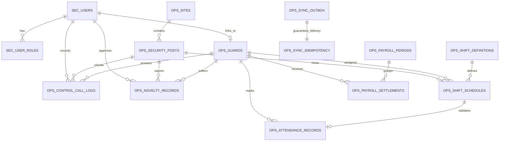
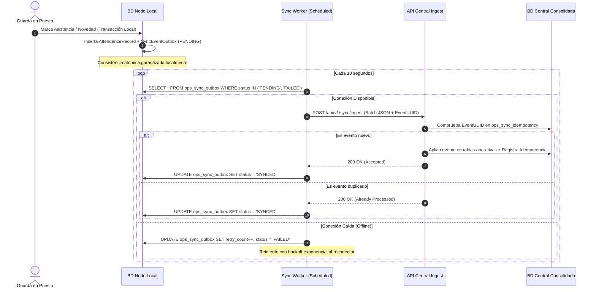

# SecurOps: Enterprise Security Operations, Workforce & Multisite Platform
## Documento de Arquitectura de Software y Diseño de Sistemas

---

### 1. Visión General del Sistema
**SecurOps** es una plataforma integral diseñada para resolver la complejidad operativa de las empresas de seguridad privada y vigilancia física. Su núcleo resuelve la generación matemática de mallas de turnos sin huecos ni solapamientos, el control de relevos en tiempo real, la sincronización tolerante a fallos de red en sedes remotas mediante el patrón *Transactional Outbox*, la liquidación legal de nómina operativa con recargos diurnos/nocturnos/festivos y el scoring analítico de guardas.

---

### 2. Arquitectura de Datos (Diagrama Entidad-Relación)

A continuación se presenta el modelo relacional normalizado que asegura la integridad referencial y el rendimiento mediante índices específicos:



#### Diccionario de Datos Principal

| Entidad | Propósito | Claves e Índices Clave |
| :--- | :--- | :--- |
| `ops_security_posts` | Puestos de control físico (24/7, 12h, armado/no armado, geocerca GPS). | `code` (UK), `site_id` (FK) |
| `ops_guards` | Hoja de vida del guarda, acreditaciones, scoring y licencias de armas. | `national_id` (UK), `professional_license` (UK) |
| `ops_shift_definitions` | Catálogo de tipos de turno (D12, N12, M8, T8, N8, OFF). | `code` (UK), `type` |
| `ops_shift_schedules` | Asignación en la malla mensual guarda-puesto-turno con estado operativo. | `(guard_id, shift_date)` (UK), `(post_id, shift_date)` |
| `ops_attendance_records` | Marcación de entrada/salida real, biometría, GPS y cálculo de retardos. | `shift_schedule_id` (UK FK), `(guard_id, check_in_time)` |
| `ops_control_call_logs` | Registro de llamadas de verificación de ronda y minutas desde la central. | `(post_id, scheduled_call_time)` |
| `ops_novelty_records` | Novedades e incidentes (incapacidades, ausencias, relevos de emergencia). | `(guard_id, start_date, end_date)` |
| `ops_payroll_settlements` | Desglose mensual de horas ordinarias, extras, dominicales y monetización. | `(guard_id, payroll_period_id)` (UK) |
| `ops_sync_outbox` | Eventos transaccionales pendientes de sincronización (nodo local a central). | `event_id` (UK), `(status, created_at)` |

---

### 3. Estructura del Proyecto Spring Boot (Arquitectura Modular Monolítica)

El proyecto está organizado siguiendo principios de **Domain-Driven Design (DDD)** y arquitectura por características (*Package-by-Feature*), facilitando su desacoplamiento en microservicios independientes si la escala lo requiere:

```
securops-core/
├── pom.xml
└── src/
    ├── main/
    │   ├── java/com/securops/
    │   │   ├── SecurOpsApplication.java
    │   │   └── modules/
    │   │       ├── security/               # Módulo de Autenticación y RBAC
    │   │       │   ├── config/SecurityConfig.java
    │   │       │   ├── entity/User.java, RoleType.java
    │   │       │   └── jwt/JwtTokenProvider.java, JwtAuthenticationFilter.java
    │   │       ├── posts/                  # Módulo de Puestos de Control y Sedes
    │   │       │   ├── entity/Site.java, SecurityPost.java, ServiceCoverageType.java
    │   │       │   └── repository/SecurityPostRepository.java
    │   │       ├── guards/                 # Módulo de Guardas y Analítica de Rendimiento
    │   │       │   ├── dto/GuardMetricsDto.java
    │   │       │   ├── entity/Guard.java, GuardStatus.java
    │   │       │   ├── repository/GuardRepository.java
    │   │       │   ├── service/GuardScoringService.java
    │   │       │   └── controller/GuardAnalyticsController.java
    │   │       ├── shifts/                 # Módulo del Motor de Mallas y Turnos
    │   │       │   ├── engine/
    │   │       │   │   ├── RotationStrategy.java
    │   │       │   │   ├── TwoByTwoRotationStrategy.java       (2x2x2 12h)
    │   │       │   │   ├── ThreeByThreeRotationStrategy.java   (3x3 12h)
    │   │       │   │   ├── FourByFourRotationStrategy.java     (4x4 12h)
    │   │       │   │   ├── SixByOneRotationStrategy.java       (6x1 8h)
    │   │       │   │   ├── FiveByTwoRotationStrategy.java      (5x2 8h)
    │   │       │   │   └── ShiftMeshGeneratorEngine.java
    │   │       │   ├── entity/ShiftDefinition.java, ShiftSchedule.java, RotationScheme.java
    │   │       │   ├── repository/ShiftScheduleRepository.java
    │   │       │   ├── service/ShiftManagementService.java
    │   │       │   └── controller/ShiftScheduleController.java
    │   │       ├── attendance/             # Módulo de Asistencia y Marcación Biométrica
    │   │       │   ├── entity/AttendanceRecord.java, AttendanceStatus.java
    │   │       │   └── repository/AttendanceRecordRepository.java
    │   │       ├── monitoring/             # Módulo de Llamadas de Control y Minutas
    │   │       │   ├── entity/ControlCallLog.java, NoveltyRecord.java, NoveltyType.java
    │   │       │   └── repository/ControlCallLogRepository.java, NoveltyRecordRepository.java
    │   │       ├── payroll/                # Módulo de Nómina y Liquidación Legal
    │   │       │   ├── entity/PayrollPeriod.java, PayrollSettlement.java
    │   │       │   ├── repository/PayrollSettlementRepository.java
    │   │       │   ├── service/PayrollCalculatorService.java
    │   │       │   └── controller/PayrollController.java
    │   │       └── sync/                   # Módulo de Sincronización Resiliente Multisitio
    │   │           ├── entity/SyncEventOutbox.java, IdempotencyStore.java, SyncStatus.java
    │   │           ├── repository/SyncEventOutboxRepository.java, IdempotencyStoreRepository.java
    │   │           ├── service/MultisiteSyncService.java
    │   │           └── controller/SyncController.java
    │   └── resources/
    │       ├── application.yml
    │       └── db/migration/V1__init_schema.sql
    └── test/
        └── java/com/securops/modules/shifts/engine/RotationStrategyTest.java
```

---

### 4. Motor de Generación de Mallas y Rotación de Turnos

#### Fundamento Matemático del Esquema 2x2x2 (12 Horas, Cobertura 24/7)
Para un puesto con requerimiento continuo de 24 horas (`CONTINUOUS_24_7`), cada día requiere 2 turnos de 12h: Diurno (06:00 - 18:00) y Nocturno (18:00 - 06:00).
El ciclo individual se compone de 6 días:
$$\text{Ciclo} = [D, D, N, N, L, L]$$
- En 6 días se generan $6 \times 2 = 12$ turnos de puesto requeridos.
- Cada guarda trabaja 4 turnos y descansa 2 días.
- Número exacto de guardas requeridos por puesto:
$$\frac{12 \text{ turnos}}{4 \text{ turnos/guarda}} = 3 \text{ guardas}$$

Para garantizar cobertura 100% sin solapamientos, los 3 guardas se desfasarán en fase con un offset de 2 días:

| Día del Ciclo | Guarda A (Fase 0) | Guarda B (Fase +2) | Guarda C (Fase +4) | Estado Cobertura 24/7 |
| :---: | :---: | :---: | :---: | :---: |
| **Día 0** | **Diurno 12h** | *Descanso* | **Nocturno 12h** | 100% Cubierto (1D, 1N) |
| **Día 1** | **Diurno 12h** | *Descanso* | **Nocturno 12h** | 100% Cubierto (1D, 1N) |
| **Día 2** | **Nocturno 12h** | **Diurno 12h** | *Descanso* | 100% Cubierto (1D, 1N) |
| **Día 3** | **Nocturno 12h** | **Diurno 12h** | *Descanso* | 100% Cubierto (1D, 1N) |
| **Día 4** | *Descanso* | **Nocturno 12h** | **Diurno 12h** | 100% Cubierto (1D, 1N) |
| **Día 5** | *Descanso* | **Nocturno 12h** | **Diurno 12h** | 100% Cubierto (1D, 1N) |

> [!TIP]
> Esta formulación se implementa en [`TwoByTwoRotationStrategy.java`](file:///c:/Users/USUARIO/Downloads/ProjectsGoogle/SecurOps/src/main/java/com/securops/modules/shifts/engine/TwoByTwoRotationStrategy.java) y es auditada automáticamente por [`ShiftMeshGeneratorEngine.java`](file:///c:/Users/USUARIO/Downloads/ProjectsGoogle/SecurOps/src/main/java/com/securops/modules/shifts/engine/ShiftMeshGeneratorEngine.java). Si la cuadrilla cuenta con menos de 3 guardas, el sistema marca inmediatamente los turnos faltantes con estado `UNCOVERED` y emite alertas operativas al supervisor.

---

### 5. Mecanismo de Sincronización Multisitio Resiliente (Offline-Tolerant)

Las sedes locales y puestos de control suelen experimentar microcortes de conectividad o cortes prolongados de internet. Para garantizar cero pérdida de datos y tolerancia a particiones de red, SecurOps adopta el patrón **Transactional Outbox** con **Idempotencia Central**:



---

### 6. Motor de Liquidación de Nómina Operativa y Novedades

La clase [`PayrollCalculatorService.java`](file:///c:/Users/USUARIO/Downloads/ProjectsGoogle/SecurOps/src/main/java/com/securops/modules/payroll/service/PayrollCalculatorService.java) analiza cada turno asistido contrastándolo con el reloj del puesto y el marco regulatorio:

1. **Ventana Horaria Diurna vs. Nocturna**:
   - Diurna: 06:00 a 21:00.
   - Nocturna: 21:00 a 06:00 del día siguiente.
2. **Turnos de 12 Horas Diurnas (06:00 - 18:00)**:
   - 8 horas Ordinarias Diurnas.
   - 4 horas Extra Diurnas (HED a 1.25x).
   - En Domingo/Festivo: 8 horas Dominicales (1.75x) + 4 horas Extra Dominical Diurna (HEDD a 2.00x).
3. **Turnos de 12 Horas Nocturnas (18:00 - 06:00)**:
   - 18:00 a 21:00 (3 horas): Ordinarias Diurnas.
   - 21:00 a 02:00 (5 horas): Ordinarias con Recargo Nocturno (+35%).
   - 02:00 a 06:00 (4 horas): Horas Extra Nocturnas (HEN a 1.75x).
   - En Domingo/Festivo: Recargos festivos proporcionales (HEDN a 2.50x).
4. **Descuentos por Novedades**:
   - Ausencias injustificadas descuentan las horas programadas del turno más la penalidad sobre el descanso remunerado.

---

### 7. Motor de Scoring y Rendimiento del Guarda

El algoritmo de [`GuardScoringService.java`](file:///c:/Users/USUARIO/Downloads/ProjectsGoogle/SecurOps/src/main/java/com/securops/modules/guards/service/GuardScoringService.java) computa una métrica ponderada de 0 a 100 puntos:

$$\text{Score} = (0.40 \times \% \text{Asistencia}) + (0.25 \times \% \text{Puntualidad}) + (0.35 \times \% \text{Cumplimiento Rondas/Llamadas}) - (10 \times N_{\text{disciplinarios}})$$

- **Clasificación por Nivel de Rendimiento**:
  - `EXCELLENT`: 90.00 – 100.00 puntos.
  - `GOOD`: 75.00 – 89.99 puntos.
  - `FAIR`: 60.00 – 74.99 puntos.
  - `AT_RISK`: $< 60.00$ puntos (Alerta para reubicación o proceso de bienestar/operaciones).
